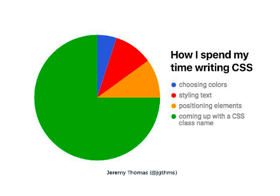
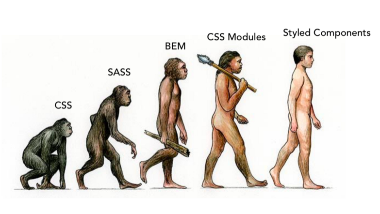

export { code as theme } from 'mdx-deck/themes'

# Proposal
### Styling 🌈

---

### What I propose? 🌹

---

### Using CSS-in-JS inside of SASS 💁‍♂️

---

### Why?
### Let's go over it 🚀

---

### Right now, 
#### we are using SASS for styling

---

### But, SASS as it is, 
#### wasn't specifically built for building Component-based User Interfaces...

---

### So what are the problems?
## Let's discuss

---

### 1. SASS abstracts the CSS model to the Document model
## rather than Component model

---

### What this means is...

---

### We get a large main.css bundle file
#### that basically has every style we have ever written
#### irrespective of whether that particular component is rendered or not...

---

## With CSS-in-JS

---

### We will be getting only those styles which are currently in use

---

### 2. Specificity

---

### The problem of naming classes 🤷t‍♂️

---

🤣

---

#### However we decide to name them, we can't run away from the problem of having selector collisions...

### On top of this,
#### We shouldn't spend so much time in NAMING only 🙄

---

### In addition to it, 
#### CSS has properties which are inherited automatically from the parent element, if not explicitly defined

---

## With CSS-in-JS

---

## We don't need to worry about all this...

---

### It generates unique class names for all our styles 

### So, that we don't have to worry about duplication, overlap or misspellings...

---

### Some other benefits of using CSS-in-JS over SASS/CSS

---

### No build step...
#### As a result — no extra dependencies to build the styles...

---

### Allows automatic vendor prefixing

---

### Dead code elimination 😰

---

### Unit tests for CSS 😯

---

### Just one language, standardized by W3C.

---

### Any questions❓❓❓

--- 

### References

- [All you need to know about CSS-in-JS](https://hackernoon.com/all-you-need-to-know-about-css-in-js-984a72d48ebc)

---

### Some people think it like this 🤖

--- 

## The Evolution 🤣🙅‍♂️

---

# The end